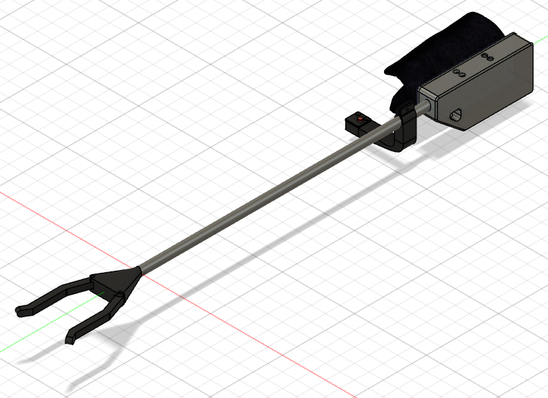

 

  

<h2 align="center">HackaHealth 2023 - Robotic Grasper Prototype</h2>

  

    A collaborative robotics project designed to empower independence.
     
  

---

## About The Project

The HackaHealth 2023 Robotic Grasper was designed and built in collaboration with a quadriplegic patient to provide a practical solution for day-to-day interactions. Our goal was to create a functional, easy-to-use robotic arm that could pick up objects from the floor and help the patient interact with their surroundings.

We started with a prototype during the HackaHealth event, where we focused on rapid design and implementation. Afterward, we iterated three times to refine the functionality, durability, and usability, ensuring the device could meet daily life demands. A push button at the back of the hand was used for clamping control, making operation simple and intuitive.

### Key Features:
- **Collaborative Design**: Co-designed with the patient to ensure usability and effectiveness.
- **Iterative Development**: Three iterations to improve functionality and reliability.
- **Practical Use**: Enables the patient to pick up items from the floor weighing up to approx. 500g.

  

---

## Built With

- **CAD Software**: Fusion 360 for design.
- **3D Printing**: PLA material for durability and lightweight parts.
- **Electronics**: Arduino-based control system with a simple push-button interface.

---

## Development Journey

### Hackathon Kickoff and Iteration 1: Refining Mechanics
The project began during HackaHealth 2023, where we rapidly designed and assembled the first prototype. The primary focus was creating a basic grasping mechanism that could meet the patient's needs. The initial version featured a push-button actuator for clamping control. Feedback from the patient helped us fine-tune the dimensions and ensure the arm could withstand repeated use.

  

### Iteration 2: Enhancing Usability
The second iteration introduced ergonomic and mechanical improvements. We adjusted the weight and size of the device and optimized the button placement for easier control. We also changed our mechanical pulley concept that drove the clamp movement. The grasper became more reliable, with smoother motion and better feedback.

  

### Iteration 3: Daily-Life Ready
In the final iteration, we redesigned the parts to be even lighter and neater. We made the version ready-to-use, so that the patient can now use the device to pick up objects from the floor and interact with their surroundings confidently in his daily life.

  

---

## Acknowledgments

This project was made possible through the incredible team at HackaHealth 2023, ETH Zurich, and the invaluable collaboration of our partner, whose insights guided every design decision.

(<a href="#readme-top">back to top</a>)
 
